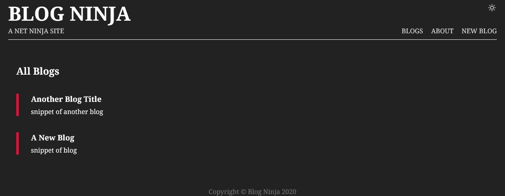

# Files structure
views/index,about,404.ejs...  
views/partials/head,footer,nav.ejs...  
public/styles.css,script.js,pic.svg  

models/blog.js (mongodb db model)  
routes/blogRoutes.js (route handlers)  
controllers/blogController.js (blog routes)  

# Start server
npm i > localhost:3000  
nodemon app.js  

# Expressjs blog with mongodb

